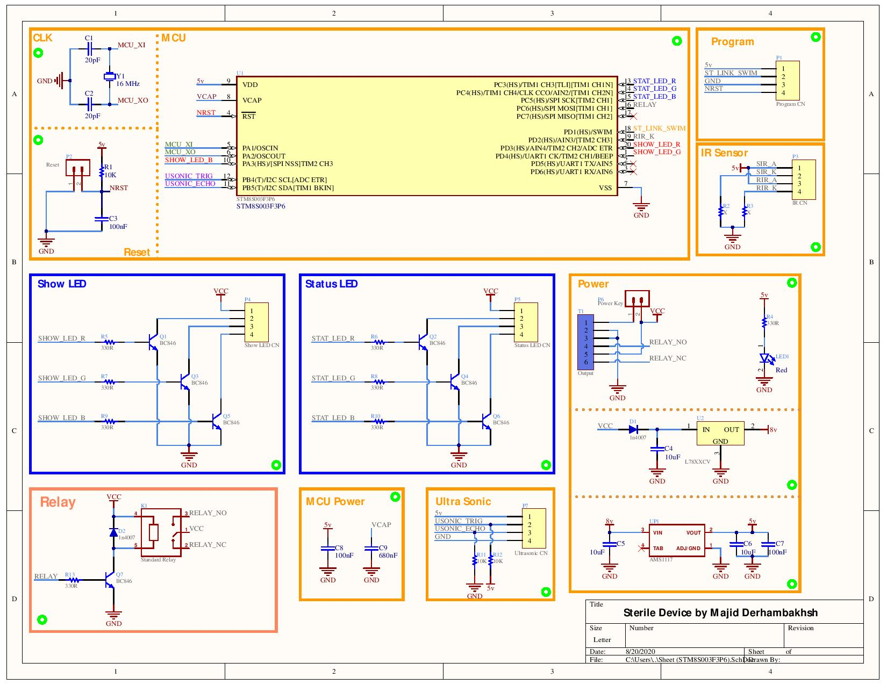
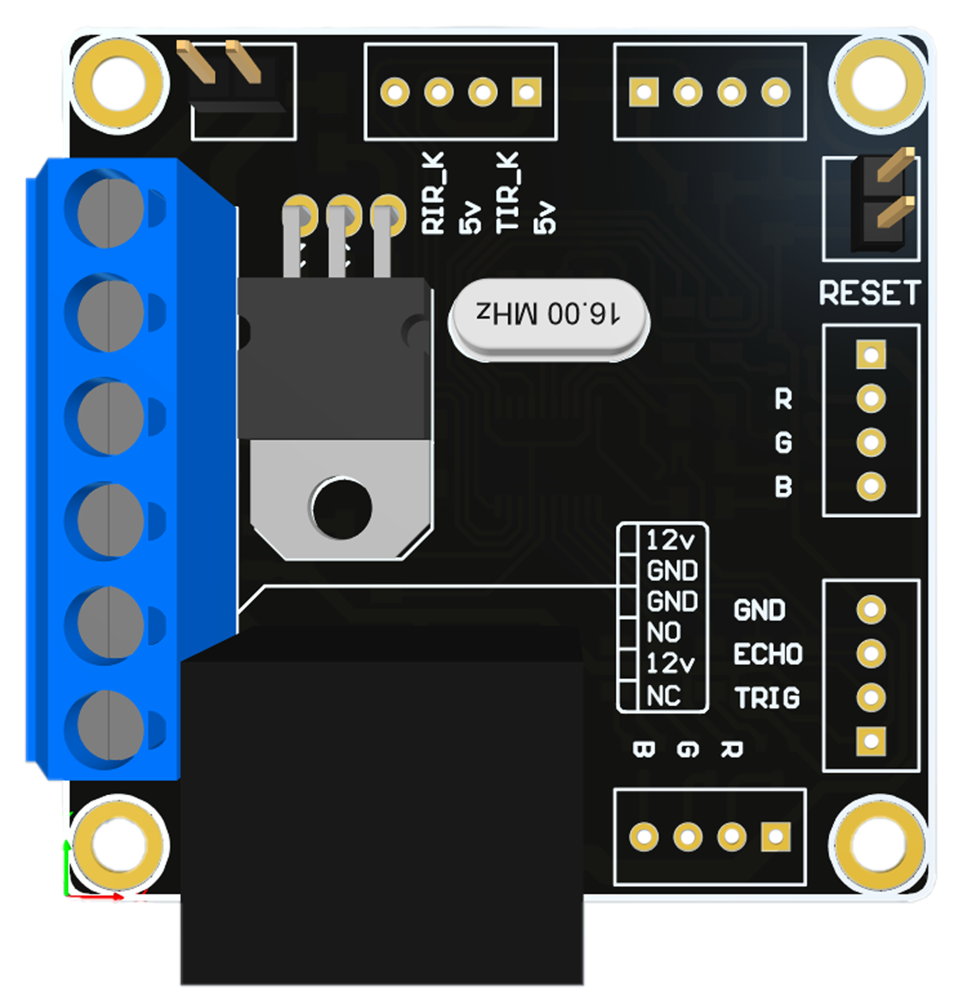

# Sterile Device STM8Base
Sterile device based on STM8S003F microcontroller
- STM32 Version : [Sterile Device STM32Base](https://github.com/Majid-Derhambakhsh/Sterile-Device-STM32Base)  

```diff  
- Notice : Program Uploading Soon
```

### Version : 1.0.0

- #### Type : Open Source ~ Embedded Device.

- #### Processor : STM8S003F.

- #### Program Language : C

- #### Compiler : IAR Embedded Workbench.

### PCB Properties :

- #### Type : Single Layer

- #### Size : 50mm * 50mm

- #### Min Trace width : 0.3mm

### Component List :

Part | Package | Voltage | Quantity
------------ | ------------- | ------------- | -------------
STM8S003F | TSSOP20 | | 1
Regulator AMS1117 5.0 | SMD SOT-223 | | 1
Regulator LM7805 8.0 | SMD SOT-223 | | 1
Resistor 10 KOhm | SMD 1206 | | 3
Resistor 330 Ohm | SMD 1206 | | 8
Resistor X Ohm (IR Biasing) | SMD 1206 | | 2
Capacitor 680 nF | SMD 1206 | 5v | 1
Capacitor 100 nF | SMD 1206 | 5v | 3
Capacitor 10 uF | SMD 1206 | 12v | 3
Capacitor 20 pF | SMD 0805 | 5v | 2
Diode LED | SMD 1206 | | 1
Diode 1N4007 | SMD | | 2
Transistor BC846 | SMD SOT-23 | | 7
XTAL 12MHz | TH Standard | | 1
Millon Relay | TH Standard | Vin | 1
6Pin Terminal | TH Standard | | 1
2Pin Header | 2.54mm | | 2
4Pin Header | 2.54mm | | 5

### Circuit schematic



### PCB View



#### Developer: Majid Derhambakhsh
